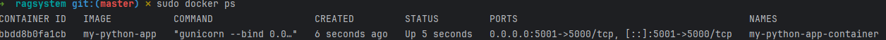

# RAG System

Example of a RAG system built with Flask, MongoDB, and transformers.
https://github.com/SamuelSchmidgall/AgentLaboratory

## Description

This project is a Retrieval-Augmented Generation (RAG) system built with Flask, MongoDB, and transformers. It allows
users to create, store, and search documents, leveraging state-of-the-art language models for generating responses to
user queries.

## Setup

### Prerequisites

- Python 3.x
- MongoDB

### Installation

1. Clone the repository:

    ```bash
    git clone https://github.com/yourusername/rag-project.git
    cd rag-project
    ```

    2. Create and activate a virtual environment:

       On Windows:

        ```bash
        python3 -m venv .venv
        .\.venv\Scripts\activate
        ```

       On Linux/macOS:

        ```bash
        python3 -m venv .venv7
        source .venv/bin/activate
          ```

       ```bash     
   fast steps
   ragsystem git:(master) ✗ cd .venv
   .venv git:(master) ✗ source bin/activate
   (.venv) ➜ .venv git:(master) ✗ cd /mnt/c/Users/ragsystem/rag/com

   (.venv7) ➜ .venv7 git:(master) ✗ cd /mnt/c/Users//ragsystem/          
   (.venv7) ➜ ragsystem git:(master) ✗ pip install -r requirements.txt
   (.venv7) ➜ com git:(master) ✗ python3 run.py
    ```

3. Install dependencies:

    ```bash
   ➜  ragsystem git:(master) ✗ cd .venv7
   ➜  .venv7 git:(master) ✗     source bin/activate

    pip install -r requirements.txt
    ```

4. Set up environment variables:

   Create a `.env` file in the project root directory and add the following variables:

    ```plaintext
MONGO_URI=mongodb://localhost:27017/ 
DB_NAME=queryDB
COLLECTION_NAME=queries
    ```

5. Configure additional settings:

   Edit the `config.json` file in the project root directory to specify model configuration values:

    ```json
    {
      "model_name_or_path": "gpt2"
    }
    ```

### Running the Application

1. Ensure MongoDB is running:

    ```bash
    mongod
    ```

2. Run the Flask application:

    ```bash
    head "C:/Users/adiogoti/IdeaProjects/ragsystem/requirements.txt"
    ```

3. Access the application:

   Open your web browser and navigate to `http://127.0.0.1:5000/`.
## API Documentation

## API Endpoints
- `GET /api/v1/endpoints` - List all available endpoints
- `POST /api/v1/search` - Search documents
- `POST /api/v1/generate` - Generate answers
- `GET /api/v1/documents` - List all documents
- `POST /api/v1/documents` - Upload a document
- `GET /api/v1/documents/<file_id>` - Get document
- 
### Create User

- **URL:** `/create_user`
- **Method:** `POST`
- **Payload:**

    ```json
    {
      "name": "John Doe"
    }
    ```

### Generate Response

- **URL:** `/generate`
- **Method:** `POST`
- **Payload:**

    ```json
    {
      "query": "What are the benefits of solar energy?"
    }
    ```

### Search Documents

- **URL:** `/search`
- **Method:** `POST`
- **Payload:**

    ```json
    {
      "query": "solar energy"
    }
    ```
  ```CONSOLE
     curl -X POST http://127.0.0.1:5000/generate -H "Content-Type: application/json" -d '{"query": "what is bdd scenario in testing?  "}'
    ```

### List Endpoints

- **URL:** `/list_endpoints`
- **Method:** `GET`

### Upload Document

- **URL:** `/upload_document`
- **Method:** `POST`
- **Payload:**

  Form-data with a file field named `file`.

### Example:

Usage examples:

# Simple search

response = requests.post('http://localhost:5000/api/v1/search',
json={"query": "your query"})

# Search with sentiment analysis

response = requests.post('http://localhost:5000/api/v1/search',
json={
"query": "your query",
"include_sentiment": True
})

# Search specific file

response = requests.post('http://localhost:5000/api/v1/search',
json={
"query": "your query",
"filename": "specific_file.txt"
})

# Generate an answer

response = requests.post('http://localhost:5000/api/v1/generate',
json={"query": "your question"})

# Read a specific document

response = requests.get('http://localhost:5000/api/v1/documents/file_id')

# Upload a document

files = {'file': open('document.txt', 'rb')}
response = requests.post('http://localhost:5000/api/v1/documents', files=files)

```bash

```

## How to run test cases

```bash
 pytest -v tests/test_api_integration.py -s
```

## License

This project is licensed under the MIT License. See the LICENSE file for more details.

## Docker
Steps to Build and Run the Docker Container
Navigate to your project directory where the Dockerfile is located.  
Build the Docker image:  
docker build -t my-python-app .

```bash
sudo docker build -t my-python-app . 
```

Run the Docker container:

```bash
sudo
docker
docker run -d -p 5001:5000 --name my-python-app-container my-python-app
```

This will build the Docker image and run the con
check docker container status

```bash
 sudo docker ps  
 
```


Navigate to http://localhost:5000/ in your web browser to access the application.
or

```bash
curl -X POST http://127.0.0.1:5000/api/v1/search -H "Content-Type: application/json" -d '{"query": "create_user"}'
```

# Remove the existing container

sudo docker rm -f my-python-app-container